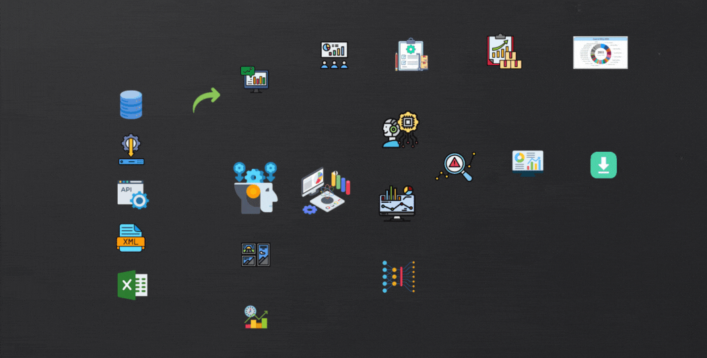

# Infrared
## Pre-build Statistical & ML Models to trigger outliers on Big Data
A first of its kind concept that lets you discover counterintuitive patterns and insights often invisible due to limitations of the human mind, biases, and voluminous data.

Unleash the power of machine learning and advanced statistics to find outliers and exceptions in your data. This application provides an instant output that can be reviewed and acted upon with agility to stop revenue leakages, improve efficiency and detect/prevent fraud.

